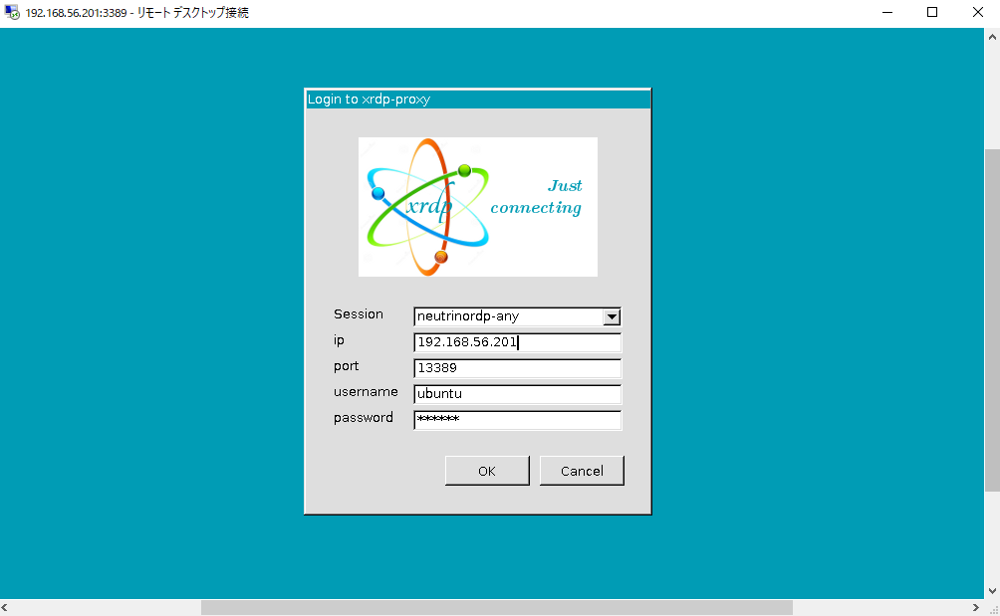

# xrdp-proxy [](https://github.com/naruhito/xrdp-proxy/actions)

Yet another RDP-proxy (xrdp with neutrinordp option enabled) on Ubuntu 22.04 docker.

```
docker-compose pull
docker-compose up
docker-compose rm
```

## Screenshots

RDP-proxy on 192.168.56.201:3389



Proxy-target on 192.168.56.201:13389


## References

- [NeutrinoRDP proxy module for xrdp](https://github.com/neutrinolabs/xrdp/wiki/NeutrinoRDP-proxy-module-for-xrdp)
- [NeutrinoRDP Compilation Guide](https://github.com/neutrinolabs/NeutrinoRDP/wiki/Compilation)
- [GitHub TOMATO-ONE xrdp-proxy](https://github.com/TOMATO-ONE/xrdp-proxy)
- [xrdp でRDP Proxy ゲートウェイ を作る話(4)　〜設定編〜](https://qiita.com/JUNKER_TOMATO/items/51cbff0fcc8fd6c792b1)
